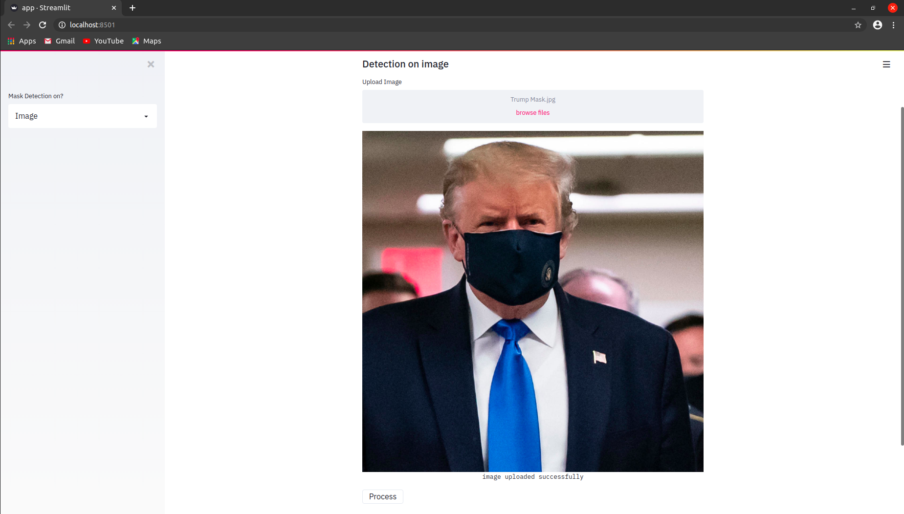
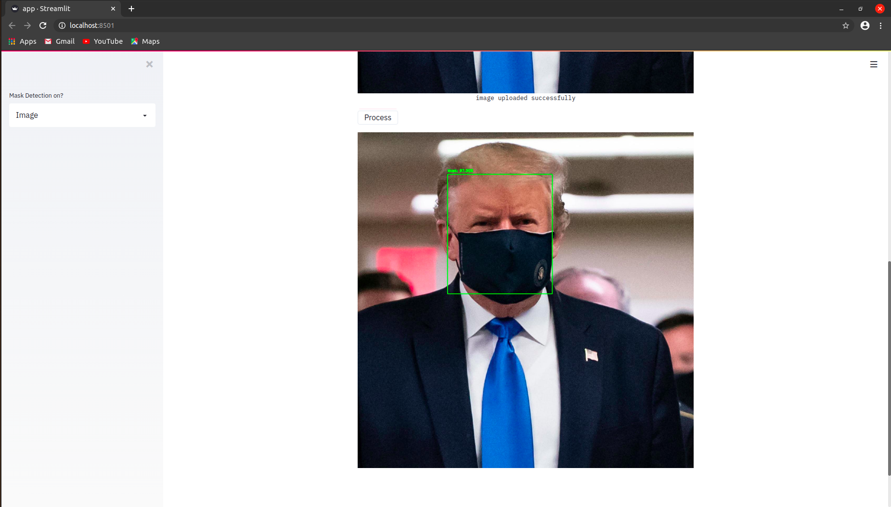
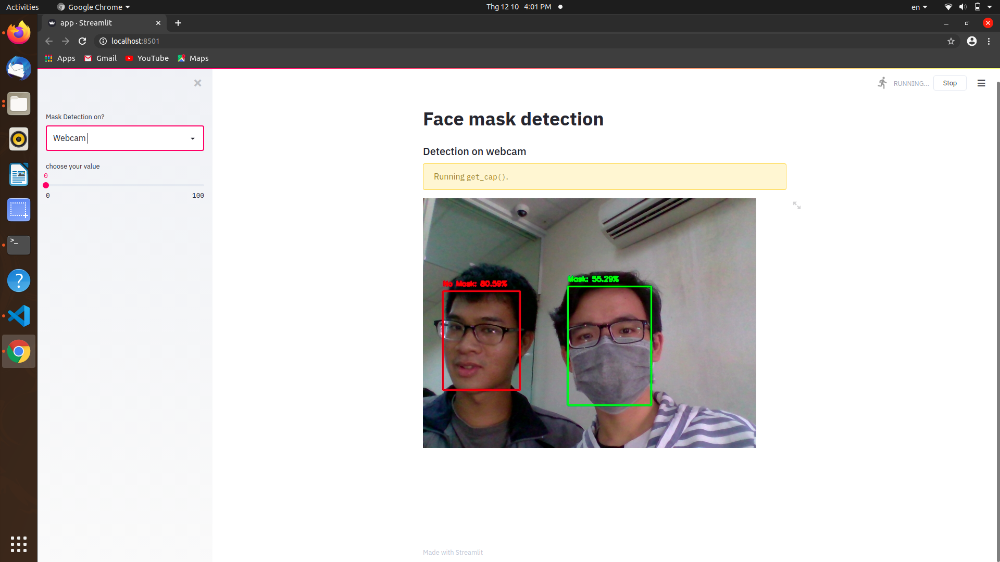
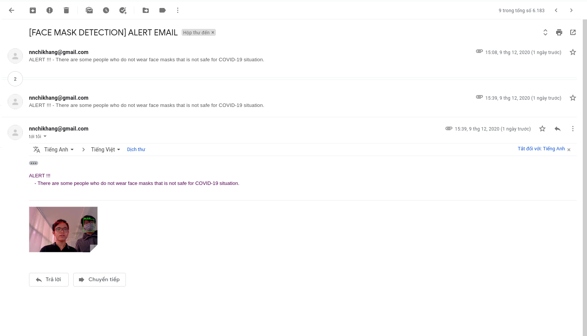

<h1 align="center">CSE - HCMUT - Face Mask Detection</h1>

<div align= "center">
  <h4>We built Face Mask Detection system with OpenCV, Keras/TensorFlow using Deep Learning and Computer Vision concepts in order to detect face masks in static images as well as in real-time video streams that we have interface for those demonstrations with Streamlit. We also add a feature of sending email when there are many people do not wear masks in the considered period of time.</h4>
</div>

&nbsp;&nbsp;&nbsp;&nbsp;&nbsp;&nbsp;&nbsp;&nbsp;&nbsp;&nbsp;&nbsp;&nbsp;&nbsp;&nbsp;&nbsp;&nbsp;&nbsp;&nbsp;&nbsp;&nbsp;&nbsp;&nbsp;&nbsp;&nbsp;&nbsp;&nbsp;&nbsp;&nbsp;&nbsp;&nbsp;&nbsp;&nbsp;&nbsp;&nbsp;&nbsp;
## Project Flow
<p align="center"></p>


## :innocent: Motivation
In the present scenario due to Covid-19, there is no efficient face mask detection applications which are now in high demand for transportation means, densely populated areas, residential districts, large-scale manufacturers and other enterprises to ensure safety. Also, the absence of large datasets of __‘with_mask’__ images has made this task more cumbersome and challenging. 

 
## :hourglass: Project Demo
:movie_camera: [YouTube Demo Link](https://youtu.be/iSBHSg1x-cM)

<p align="center"></p>
<p align="center"></p>

## :warning: TechStack/framework used

- [OpenCV](https://opencv.org/)
- [Caffe-based face detector](https://caffe.berkeleyvision.org/)
- [Keras](https://keras.io/)
- [TensorFlow](https://www.tensorflow.org/)
- [MobileNetV2](https://arxiv.org/abs/1801.04381)
- [SMTP protocol client](https://docs.python.org/3/library/smtplib.html)

## :warning: MobileNetv2
<p align="center"></p>
In MobileNetV2, there are two types of blocks. One is residual block with stride of 1. Another one is block with stride of 2 for downsizing.
There are 3 layers for both types of blocks.
This time, the first layer is 1×1 convolution with ReLU6.
The second layer is the depthwise convolution.
The third layer is another 1×1 convolution but without any non-linearity. It is claimed that if ReLU is used again, the deep networks only have the power of a linear classifier on the non-zero volume part of the output domain.

## :star: Features
Our face mask detector didn't use any morphed masked images dataset. The model is accurate, and since we used the MobileNetV2 architecture, it’s also computationally efficient and thus making it easier to deploy the model to embedded systems (Raspberry Pi, Google Coral, etc.).

This system can therefore be used in real-time applications which require face-mask detection for safety purposes due to the outbreak of Covid-19. This project can be integrated with embedded systems for application in airports, railway stations, offices, schools, and public places to ensure that public safety guidelines are followed.

## :file_folder: Dataset
The dataset used can be downloaded here - [Click to Download](https://drive.google.com/drive/folders/1XDte2DL2Mf_hw4NsmGst7QtYoU7sMBVG?usp=sharing)

This dataset consists of __3835 images__ belonging to two classes:
*	__with_mask: 1916 images__
*	__without_mask: 1919 images__

The images used were real images of faces wearing masks. The images were collected from the following sources:

* __Bing Search API__ ([See Python script](https://github.com/chikhang238/Face_Mask_Detection/blob/master/search.py))
* __Kaggle datasets__ 
* __RMFD dataset__ ([See here](https://github.com/X-zhangyang/Real-World-Masked-Face-Dataset))

## :key: Prerequisites

All the dependencies and required libraries are included in the file <code>requirements.txt</code> [See here](https://github.com/chandrikadeb7/Face-Mask-Detection/blob/master/requirements.txt)

## 🚀&nbsp; Installation
1. Clone the repo
```
$ git clone https://github.com/chandrikadeb7/Face-Mask-Detection.git
```

2. Change your directory to the cloned repo and create a Python virtual environment named 'test'
```
$ mkvirtualenv test
```

3. Now, run the following command in your Terminal/Command Prompt to install the libraries required
```
$ pip3 install -r requirements.txt
```

## :bulb: Working

1. Open terminal. Go into the cloned project directory and type the following command:
```
$ python3 train_mask_detector.py --dataset dataset
```

2. To detect face masks in an image type the following command: 
```
$ python3 detect_mask_image.py --image images/pic1.jpeg
```

3. To detect face masks in real-time video streams type the following command:
```
$ python3 detect_mask_video.py 
```
## :key: Results

#### We got the following accuracy/loss training curve plot


## Streamlit app

Face Mask Detector webapp using Tensorflow & Streamlit

command
```
$ streamlit run app.py 
```
## Images

<p align="center">
  
</p>
<p align="center">Upload Images</p>

<p align="center">
  
</p>
<p align="center">Results</p>

## Camera

<p align="center">
  
</p>
<p align="center">Result With Camera</p>

## Alerting Email
<p align="center">
  
</p>
<p align="center">Received Email</p>

## :clap: And it's done!
Feel free to mail me for any doubts/query 
:email: khang.nguyenngochi@hcmut.edu.vn

## :handshake: Contribution
Feel free to **file a new issue** with a respective title and description on the the [Face-Mask-Detection](https://github.com/chandrikadeb7/Face-Mask-Detection/issues) repository. If you already found a solution to your problem, **I would love to review your pull request**! 

## :heart: Owner
Made with :heart:&nbsp;  by [Intelligent System Group](https://github.com/chikhang238/)

## :+1: Credits
* [https://www.pyimagesearch.com/](https://www.pyimagesearch.com/)
* [https://www.tensorflow.org/tutorials/images/transfer_learning](https://www.tensorflow.org/tutorials/images/transfer_learning)

## :eyes: Tutorials
* [https://harshilp.medium.com/real-time-face-mask-detector-with-opencv-keras-tensorflow-and-deep-learning-d0744fe048c6](https://harshilp.medium.com/real-time-face-mask-detector-with-opencv-keras-tensorflow-and-deep-learning-d0744fe048c6)
* [https://github.com/chandrikadeb7/Face-Mask-Detection](https://github.com/chandrikadeb7/Face-Mask-Detection)
* [https://www.pyimagesearch.com/https://realpython.com/python-send-email/]https://realpython.com/python-send-email/)
* [https://towardsdatascience.com/quickly-build-and-deploy-an-application-with-streamlit-988ca08c7e83](https://towardsdatascience.com/quickly-build-and-deploy-an-application-with-streamlit-988ca08c7e83)
